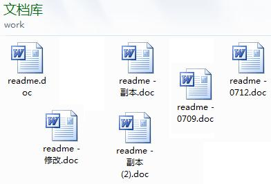

[TOC]

# git使用技巧

作者：左越

日期：2021.9

文档版本：V1.0

### 修订记录

| 日期     | 修订版本 | 描述                        | 作者 |
| -------- | -------- | --------------------------- | ---- |
| 2021-9-5 | V1.0     | git教程结构建立，内容填充。 | 左越 |

## git简介

**什么是git：**git是一个开源的分布式版本控制系统，由Linus Tovarlds（Linux之父）创作，为了更好的管理Linux内核而开发设计的。

**为什么使用git**：版本控制管理，多人协同管理。

## 版本控制管理意义

**举个例子**

> 如果你用Microsoft Word写过长篇大论，那你一定有这样的经历：<br>		想删除一个段落，又怕将来想恢复找不回来怎么办？有办法，先把当前文件“另存为……”一个新的Word文件，再接着改，改到一定程度，再“另存为……”一个新文件，这样一直改下去，最后你的Word文档变成了这样：<br><br>		过了一周，你想找回被删除的文字，但是已经记不清删除前保存在哪个文件里了，只好一个一个文件去找，真麻烦。<br>		看着一堆乱七八糟的文件，想保留最新的一个，然后把其他的删掉，又怕哪天会用上，还不敢删，真郁闷。<br>		更要命的是，有些部分需要你的财务同事帮助填写，于是你把文件Copy到U盘里给她（也可能通过Email发送一份给她)，然后，你继续修改Word文件。一天后，同事再把Word文件传给你，此时，你必须想想，发给她之后到你收到她的文件期间，你作了哪些改动，得把你的改动和她的部分合并，真困难。<br>		于是你想，如果有一个软件，不但能自动帮我记录每次文件的改动，还可以让同事协作编辑，这样就不用自己管理一堆类似的文件了，也不需要把文件传来传去。如果想查看某次改动，只需要在软件里瞄一眼就可以，岂不是很方便？<br>		这个软件用起来就应该像这个样子，能记录每次文件的改动：

| 版本 | 文件名      | 用户 | 说明                   | 日期       |
| :--- | :---------- | :--- | :--------------------- | :--------- |
| 1    | service.doc | 张三 | 删除了软件服务条款5    | 7/12 10:38 |
| 2    | service.doc | 张三 | 增加了License人数限制  | 7/12 18:09 |
| 3    | service.doc | 李四 | 财务部门调整了合同金额 | 7/13 9:51  |
| 4    | service.doc | 张三 | 延长了免费升级周期     | 7/14 15:17 |

***参考自：[廖雪峰的git教程](https://www.liaoxuefeng.com/wiki/896043488029600/896067008724000)***

## git基本概念

### 工作流程

一般工作流程如下：

- 克隆 Git 资源作为工作目录。
- 在克隆的资源上添加或修改文件。
- 如果其他人修改了，你可以更新资源。
- 在提交前查看修改。
- 提交修改。
- 在修改完成后，如果发现错误，可以撤回提交并再次修改并提交。


***参考：***[菜鸟教程](https://www.runoob.com/git/git-workflow.html)

### 工作区、暂存、本地仓库和远程仓库

- **概念介绍：**

  - **工作区（workspace）**：你能看到的目录。
  - **暂存区（index）**：一般存放在 `.git`目录下的 index 文件，即``.git/index``。
  - **版本库（repository）**：存在本地版本库和远程版本库。本地存在`.git`里。

  

- **版本管理说明：**

  - 正常写代码和文档时修改的是工作区。
  - `git add`命令将工作区的改动提交到暂存区，并在暂存区中形成一次完整的**待提交版本**，其中包含对**多个**文件的增删或改动。
  - `git commit`命令将待提交的版本保存在**版本库**，版本库是**只读**的，一旦提交不能更改，确保代码不被误改动。
  - 版本库中的每一个提交的版本都有一个指向**前一次提交**的指针，从而形成一个**版本链条**，从而使代码的改动历史可以追溯。

- **远程多人协作说明：**

  - 在多人协作的场景下git分为**本地仓库**和**远程仓库**（两个仓库都包含几乎全部提交）。
  - 本地仓库用来管理自己的代码。
  - 需要和其他人写作时，需要将远程仓库的修改pull到本地仓库，再将本地仓库的push到远程仓库。

## git使用

### 下载

[官方下载](https://git-scm.com/downloads)

### 配置全局信息

1. 配置用户信息

    ```bash
    #支持中文
    git config --global core.quotepath=false 
    #配置你的用户名
    git config --global user.name="your name"
    #配置你的邮箱
    git config --global user.email="example@mail.com"
    ```

2. 配置一些简称，这样以后输入`git st`等于`git status`

    ```bash
    #配置一些简称，可选
    git config --global alias.st status
    git config --global alias.ck checkout
    git config --global alias.st status
    git config --global alias.br branch
    git config --global alias.cf config
    git config --global alias.fc fetch
    ```

3. 最后检查一下配置列表

    ```bash
    #查看配置信息
    git config --global --list
    ```


### 创建单人、多人协作本地仓库

- **使用情况：**==必须使用==。
- **仓库位置：**服务器共享文件夹，如`/home/public/git_repo`，便于集中管理。
- **注明事项：**
  - 多人协作分工尽量明确，最好做到文件编辑独立，避免出现过多合并冲突。
  - 使用`.gitignore`过滤提交的文件，忽略对一些文件的提交，例如波形文件，`.gitkeep`保留空文件夹。==建议只保留主要文件==。[.gitignore使用](https://www.cnblogs.com/yulinlewis/p/10231035.html)

#### 创建仓库（创建者）

1. 设置仓库对应group信息，提高安全性（可选，默认group为docker即可）：

    ```bash
    #首先查看group有没有对应组：
    cat /etc/group
    #需要设置组则打开group设置，必须要root权限。
    sudo vim /etc/group
    #按i切换到编辑模式，在最下面添加如下信息:类别（算法数字模拟器件）_项目名称:x:groupid:组内成员
    class_projname:x:GID:group_members,
    #按esc，输入:wq，回车结束保存。更新完，需要重新su yourname重登一下用户启动
    ```

1. 建立远程仓库：

    ```bash
    #打开到对应路径下，该路径所有人都可以创建git（需要设置sudo chmod 777 -R git_repo）
    cd /home/public/git_repo/
    #创建仓库：--bare：空仓库，--share=group：分享到group使用者组，git_name：仓库名
    git init --bare --share=group git_name.git
    ```

2. 修改git_name文件夹的权限，包括读写执行权限、所有权。

    ```bash
    #修改仓库及其子目录下所有文件（-R）的权限为setGID——执行文件（即x）的用户以该文件所属组（group）的权限去执行。
    chmod g+s -R git_name.git
    #修改仓库及其子目录下所有文件的权限为组外不可读写执行（可选）。
    chmod 770 -R git_name.git
    #修改仓库及其子目录下所有文件的所有者为owner_name，所属组为group_name。这样只有你和group可以访问。（只有自己用的话不用执行，组内合作才需要）
    chown -R owner_name:group_name git_name.git/
    ```


#### 使用仓库（所属组的使用者）

1. 克隆仓库并进入

    ```bash
    #使用者cd到使用路径
    cd project_path
    #克隆仓库
    git clone /public_path/git_name.git
    #进入仓库
    cd git_name
    ```

2. 创建或修改文件*（下面举一个例子）*

    ```bash
    #新建一个markdown文件
    touch readme.md
    ```

3. 提交文件到暂存区

    ```bash
    #git add:提交到暂存区，git add -u:对之前提交过的文件进行提交，不用再次添加
    git add readme.md
    ```

4. 查看当前状态

   ```bash
   git status
   ```

5. 提交到本地版本库
   ```bash
   #-m 信息，提交后可以用 git commit --amend修改信息
   git commit -m "first commit"
   ```

6. 查看提交历史

   ```bash
   git log
   ```

7. 从远程仓库合并到本地工作区和本地仓库

   ```bash
   #master是git主分支，分支可以通过git branch来看
   git pull origin master
   ```

8. 推送本地仓库到远程仓库，让所有人看到

   ```bash
   #推送版本到master主分支中
   git push origin master
   ```

### 创建本地仓库

- 使用`git init`建立，自己使用不需要设置权限。
- 减少了`git pull/push`
- 其余和上面一样。

### github创建远程仓库

#### 个人开发

[菜鸟教程指南](https://www.runoob.com/git/git-remote-repo.html)

#### 多人协作

[简书](https://www.jianshu.com/p/8c69d1021d98)

## vscode+源代码管理使用说明（推荐新手使用）

### 源代码管理位置

左侧side bar第三个，或者使用`ctrl+shift+g`


### UI操作

#### 工作区<->暂存区


- 暂存更改（`git add`）：更改旁边的加号。


- 取消暂存的所有更改（`git restore`）：暂存更改旁边的减号。

#### 暂存区->覆盖工作区


- 放弃更改（`git checkout`）：更改旁边的撤回。

#### 暂存区->本地仓库


- 暂存的更改上面写提交的信息，然后`ctrl+enter`提交（`git commit -m "message"`）

#### 远程仓库->合并本地仓库->更新远程仓库


- 源代码管理器下面点击“循环”按钮，进行更新合并。（`git pull origin master + git push origin master`）

## git 进阶

[git官方书籍](https://git-scm.com/book/en/v2)

