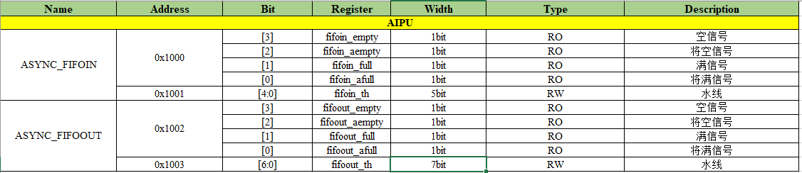
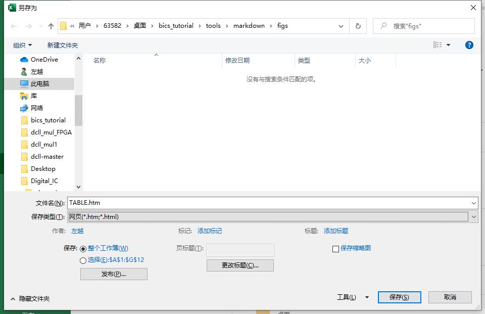
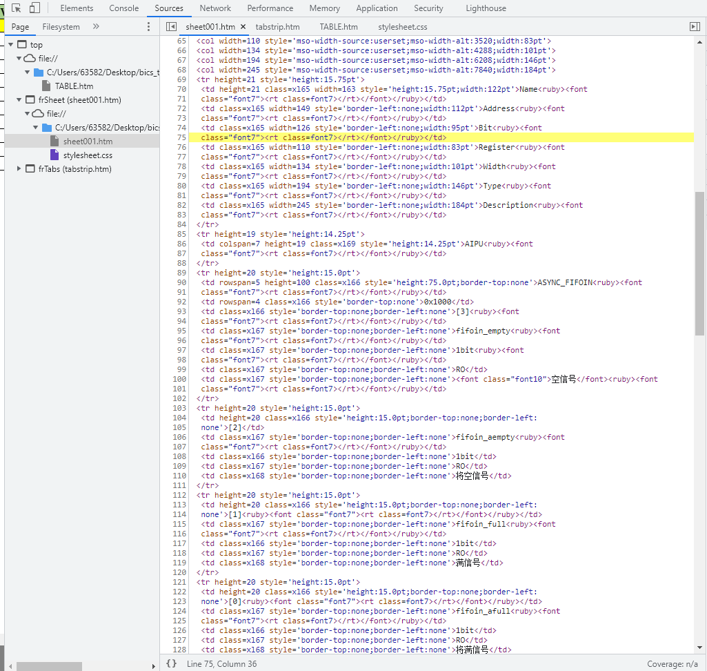
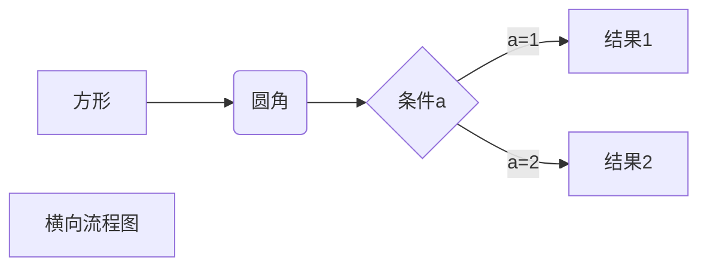
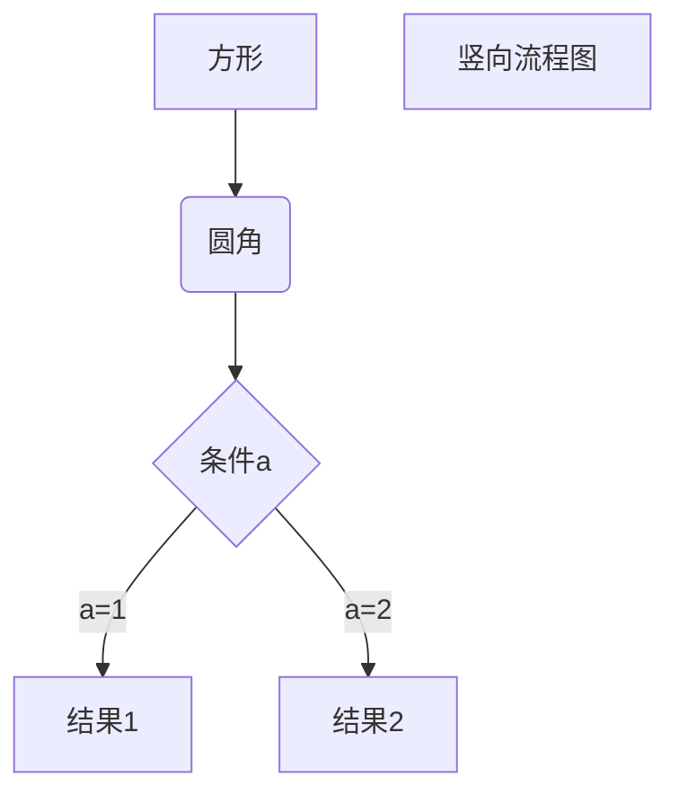
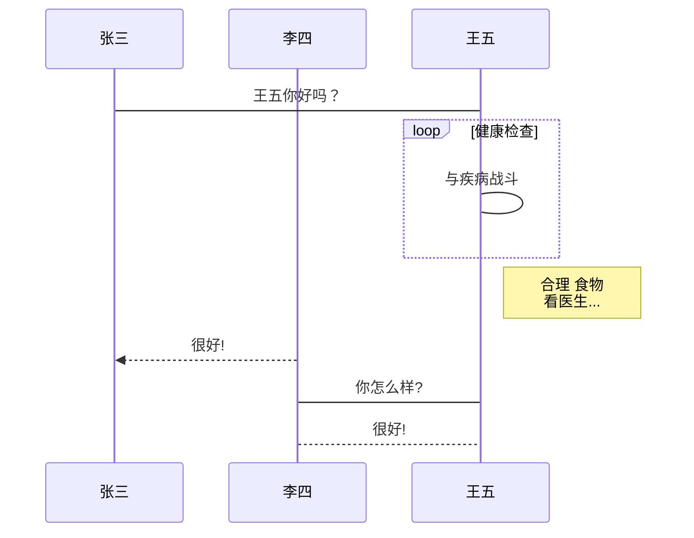
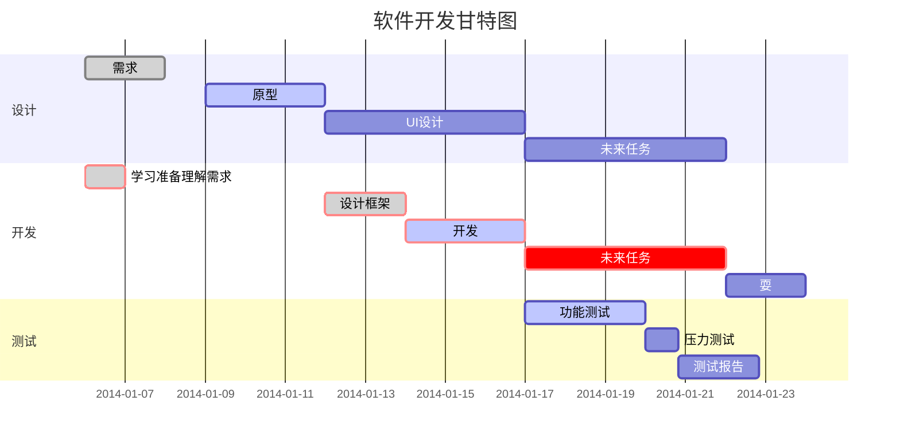

# 高级教程

[TOC]

## HTML与标签的使用

[菜鸟教程](https://www.runoob.com/html/html-colorvalues.html)

### 字体

字体采用`<font>`，下面是示例：<br>
<font face="黑体">我是黑体字</font> <br>
<font face="微软雅黑">我是微软雅黑</font><br>
<font face="STCAIYUN">我是华文彩云</font><br>
<font color=#0099ff size=7 face="黑体">color=#0099ff size=72 face="黑体"</font><br>
<font color=#00ffff size=72>color=#00ffff</font> <br>
<font color=gray size=72>color=gray</font><br>

### 背景颜色

<table><tr><td bgcolor=black><font size="5" color=white>背景色是：black（#000000），字体色是白色：white（#ffffff）</td></tr></table>

### 图片与图片表格标题

<center>
    
    <br>
    <div style="color:red; border-bottom: 2px solid #d9d9d9;
    display: inline-block;
    color: #000;
    padding: 3px;">图：Markdown的logo</div>
</center>
<center>
    <div style="color: #000;
    padding: 3px;">表：表格标题</div>
</center>

### 复杂表格（结合excel）

[参考CSDN](https://sunbc.blog.csdn.net/article/details/81033915?utm_medium=distribute.pc_relevant.none-task-blog-2%7Edefault%7ECTRLIST%7Edefault-1.no_search_link&depth_1-utm_source=distribute.pc_relevant.none-task-blog-2%7Edefault%7ECTRLIST%7Edefault-1.no_search_link)

markdown支持html语法，所以我们可以先使用excel生成我们需要的表格，然后将其转化为html格式放入markdown中：

1.   **使用excel创建一个表格，在excel中创建一个示例：**



2.   **选定表格，单击另存为，选择导出格式为html，此时可选择所需表格区间:**



3.   **用edge或者chorme打开生成的html，按F12进入开发者模式，找到下图的sheet.html中的`<table></table>`,复制下来：**



<center>
    <div style="color: #000;
    padding: 3px;">表：寄存器表单</div>
<table border=0 cellpadding=0 cellspacing=0 width=1121 style='border-collapse:
 collapse;table-layout:fixed;width:843pt'>
 <col width=163 style='mso-width-source:userset;mso-width-alt:5216;width:122pt'>
 <col width=149 style='mso-width-source:userset;mso-width-alt:4768;width:112pt'>
 <col width=126 style='mso-width-source:userset;mso-width-alt:4032;width:95pt'>
 <col width=110 style='mso-width-source:userset;mso-width-alt:3520;width:83pt'>
 <col width=134 style='mso-width-source:userset;mso-width-alt:4288;width:101pt'>
 <col width=194 style='mso-width-source:userset;mso-width-alt:6208;width:146pt'>
 <col width=245 style='mso-width-source:userset;mso-width-alt:7840;width:184pt'>
 <tr height=21 style='height:15.75pt'>
  <td height=21 class=xl65 width=163 style='height:15.75pt;width:122pt'>Name<ruby><font
  class="font7"><rt class=font7></rt></font></ruby></td>
  <td class=xl65 width=149 style='border-left:none;width:112pt'>Address<ruby><font
  class="font7"><rt class=font7></rt></font></ruby></td>
  <td class=xl65 width=126 style='border-left:none;width:95pt'>Bit<ruby><font
  class="font7"><rt class=font7></rt></font></ruby></td>
  <td class=xl65 width=110 style='border-left:none;width:83pt'>Register<ruby><font
  class="font7"><rt class=font7></rt></font></ruby></td>
  <td class=xl65 width=134 style='border-left:none;width:101pt'>Width<ruby><font
  class="font7"><rt class=font7></rt></font></ruby></td>
  <td class=xl65 width=194 style='border-left:none;width:146pt'>Type<ruby><font
  class="font7"><rt class=font7></rt></font></ruby></td>
  <td class=xl65 width=245 style='border-left:none;width:184pt'>Description<ruby><font
  class="font7"><rt class=font7></rt></font></ruby></td>
 </tr>
 <tr height=19 style='height:14.25pt'>
  <td colspan=7 height=19 class=xl69 style='height:14.25pt'>AIPU<ruby><font
  class="font7"><rt class=font7></rt></font></ruby></td>
 </tr>
 <tr height=20 style='height:15.0pt'>
  <td rowspan=5 height=100 class=xl66 style='height:75.0pt;border-top:none'>ASYNC_FIFOIN<ruby><font
  class="font7"><rt class=font7></rt></font></ruby></td>
  <td rowspan=4 class=xl66 style='border-top:none'>0x1000</td>
  <td class=xl66 style='border-top:none;border-left:none'>[3]<ruby><font
  class="font7"><rt class=font7></rt></font></ruby></td>
  <td class=xl67 style='border-top:none;border-left:none'>fifoin_empty<ruby><font
  class="font7"><rt class=font7></rt></font></ruby></td>
  <td class=xl67 style='border-top:none;border-left:none'>1bit<ruby><font
  class="font7"><rt class=font7></rt></font></ruby></td>
  <td class=xl67 style='border-top:none;border-left:none'>RO</td>
  <td class=xl67 style='border-top:none;border-left:none'><font class="font10">空信号</font><ruby><font
  class="font7"><rt class=font7></rt></font></ruby></td>
 </tr>
 <tr height=20 style='height:15.0pt'>
  <td height=20 class=xl66 style='height:15.0pt;border-top:none;border-left:
  none'>[2]</td>
  <td class=xl67 style='border-top:none;border-left:none'>fifoin_aempty<ruby><font
  class="font7"><rt class=font7></rt></font></ruby></td>
  <td class=xl66 style='border-top:none;border-left:none'>1bit</td>
  <td class=xl67 style='border-top:none;border-left:none'>RO</td>
  <td class=xl68 style='border-top:none;border-left:none'>将空信号</td>
 </tr>
 <tr height=20 style='height:15.0pt'>
  <td height=20 class=xl66 style='height:15.0pt;border-top:none;border-left:
  none'>[1]<ruby><font class="font7"><rt class=font7></rt></font></ruby></td>
  <td class=xl67 style='border-top:none;border-left:none'>fifoin_full<ruby><font
  class="font7"><rt class=font7></rt></font></ruby></td>
  <td class=xl66 style='border-top:none;border-left:none'>1bit</td>
  <td class=xl67 style='border-top:none;border-left:none'>RO</td>
  <td class=xl68 style='border-top:none;border-left:none'>满信号</td>
 </tr>
 <tr height=20 style='height:15.0pt'>
  <td height=20 class=xl66 style='height:15.0pt;border-top:none;border-left:
  none'>[0]<ruby><font class="font7"><rt class=font7></rt></font></ruby></td>
  <td class=xl67 style='border-top:none;border-left:none'>fifoin_afull<ruby><font
  class="font7"><rt class=font7></rt></font></ruby></td>
  <td class=xl66 style='border-top:none;border-left:none'>1bit</td>
  <td class=xl67 style='border-top:none;border-left:none'>RO</td>
  <td class=xl68 style='border-top:none;border-left:none'>将满信号</td>
 </tr>
 <tr height=20 style='height:15.0pt'>
  <td height=20 class=xl66 style='height:15.0pt;border-top:none;border-left:
  none'>0x1001</td>
  <td class=xl66 style='border-top:none;border-left:none'>[4:0]</td>
  <td class=xl66 style='border-top:none;border-left:none'>fifoin_th</td>
  <td class=xl66 style='border-top:none;border-left:none'>5bit</td>
  <td class=xl67 style='border-top:none;border-left:none'>RW</td>
  <td class=xl68 style='border-top:none;border-left:none'>水线</td>
 </tr>
 <tr height=20 style='height:15.0pt'>
  <td rowspan=5 height=100 class=xl66 style='height:75.0pt;border-top:none'>ASYNC_FIFOOUT<ruby><font
  class="font7"><rt class=font7></rt></font></ruby></td>
  <td rowspan=4 class=xl66 style='border-top:none'>0x1002</td>
  <td class=xl66 style='border-top:none;border-left:none'>[3]<ruby><font
  class="font7"><rt class=font7></rt></font></ruby></td>
  <td class=xl67 style='border-top:none;border-left:none'>fifoout_empty</td>
  <td class=xl67 style='border-top:none;border-left:none'>1bit<ruby><font
  class="font7"><rt class=font7></rt></font></ruby></td>
  <td class=xl67 style='border-top:none;border-left:none'>RO</td>
  <td class=xl67 style='border-top:none;border-left:none'><font class="font10">空信号</font><ruby><font
  class="font7"><rt class=font7></rt></font></ruby></td>
 </tr>
 <tr height=20 style='height:15.0pt'>
  <td height=20 class=xl66 style='height:15.0pt;border-top:none;border-left:
  none'>[2]</td>
  <td class=xl67 style='border-top:none;border-left:none'>fifoout_aempty</td>
  <td class=xl66 style='border-top:none;border-left:none'>1bit</td>
  <td class=xl67 style='border-top:none;border-left:none'>RO</td>
  <td class=xl68 style='border-top:none;border-left:none'>将空信号</td>
 </tr>
 <tr height=20 style='height:15.0pt'>
  <td height=20 class=xl66 style='height:15.0pt;border-top:none;border-left:
  none'>[1]<ruby><font class="font7"><rt class=font7></rt></font></ruby></td>
  <td class=xl67 style='border-top:none;border-left:none'>fifoout_full</td>
  <td class=xl66 style='border-top:none;border-left:none'>1bit</td>
  <td class=xl67 style='border-top:none;border-left:none'>RO</td>
  <td class=xl68 style='border-top:none;border-left:none'>满信号</td>
 </tr>
 <tr height=20 style='height:15.0pt'>
  <td height=20 class=xl66 style='height:15.0pt;border-top:none;border-left:
  none'>[0]<ruby><font class="font7"><rt class=font7></rt></font></ruby></td>
  <td class=xl67 style='border-top:none;border-left:none'>fifoout_afull</td>
  <td class=xl66 style='border-top:none;border-left:none'>1bit</td>
  <td class=xl67 style='border-top:none;border-left:none'>RO</td>
  <td class=xl68 style='border-top:none;border-left:none'>将满信号</td>
 </tr>
 <tr height=20 style='height:15.0pt'>
  <td height=20 class=xl66 style='height:15.0pt;border-top:none;border-left:
  none'>0x1003</td>
  <td class=xl66 style='border-top:none;border-left:none'>[6:0]</td>
  <td class=xl67 style='border-top:none;border-left:none'>fifoout_th</td>
  <td class=xl66 style='border-top:none;border-left:none'>7bit</td>
  <td class=xl67 style='border-top:none;border-left:none'>RW</td>
  <td class=xl68 style='border-top:none;border-left:none'>水线</td>
 </tr>
 <![if supportMisalignedColumns]>
 <tr height=0 style='display:none'>
  <td width=163 style='width:122pt'></td>
  <td width=149 style='width:112pt'></td>
  <td width=126 style='width:95pt'></td>
  <td width=110 style='width:83pt'></td>
  <td width=134 style='width:101pt'></td>
  <td width=194 style='width:146pt'></td>
  <td width=245 style='width:184pt'></td>
 </tr>
 <![endif]>
</table>
    </center>

==因为表格的格式被放在`.css`中，所以格式都没了，这样也足够用了。==

## LATEX公式（

Markdown支持LATEX公式，==熟练的话建议word也用这个，比自带公式不知道快到那里去了==。

### 参考，建议边练边学

[知乎](https://zhuanlan.zhihu.com/p/95886235)

[CSDN](https://blog.csdn.net/fzch_struggling/article/details/44998901)

### 举例子

$$
J\alpha(x) = \sum_{m=0}^\infty \frac{(-1)^m}{m! \Gamma (m + \alpha + 1)} {\left({ \frac{x}{2} }\right)}^{2m + \alpha}
$$

## 画图（简单用这个，复杂用visio）

### Mermaid

#### 横向流程图



#### 竖向流程图



#### 时序图



#### 甘特图



### flow

#### 流程图

```flow
st=>start: 开始框
op=>operation: 处理框
cond=>condition: 判断框(是或否?)
sub1=>subroutine: 子流程
io=>inputoutput: 输入输出框
e=>end: 结束框
st->op->cond
cond(yes)->io->e
cond(no)->sub1(right)->op
```

#### 横向流程图

```flow
st=>start: 开始框
op=>operation: 处理框
cond=>condition: 判断框(是或否?)
sub1=>subroutine: 子流程
io=>inputoutput: 输入输出框
e=>end: 结束框
st(right)->op(right)->cond
cond(yes)->io(bottom)->e
cond(no)->sub1(right)->op
```

### sequence

#### UML时序图

```sequence
对象A->对象B: 对象B你好吗?（请求）
Note right of 对象B: 对象B的描述
Note left of 对象A: 对象A的描述(提示)
对象B-->对象A: 我很好(响应)
对象A->对象B: 你真的好吗？
```

#### UML复杂时序图

```sequence
Title: 标题：复杂使用
对象A->对象B: 对象B你好吗?（请求）
Note right of 对象B: 对象B的描述
Note left of 对象A: 对象A的描述(提示)
对象B-->对象A: 我很好(响应)
对象B->小三: 你好吗
小三-->>对象A: 对象B找我了
对象A->对象B: 你真的好吗？
Note over 小三,对象B: 我们是朋友
participant C
Note right of C: 没人陪我玩
```

