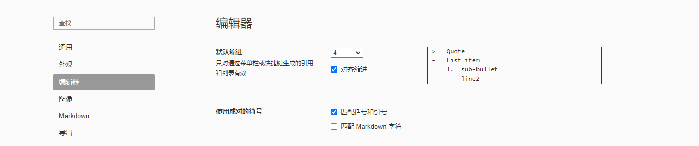
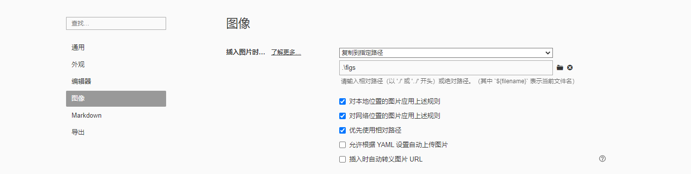
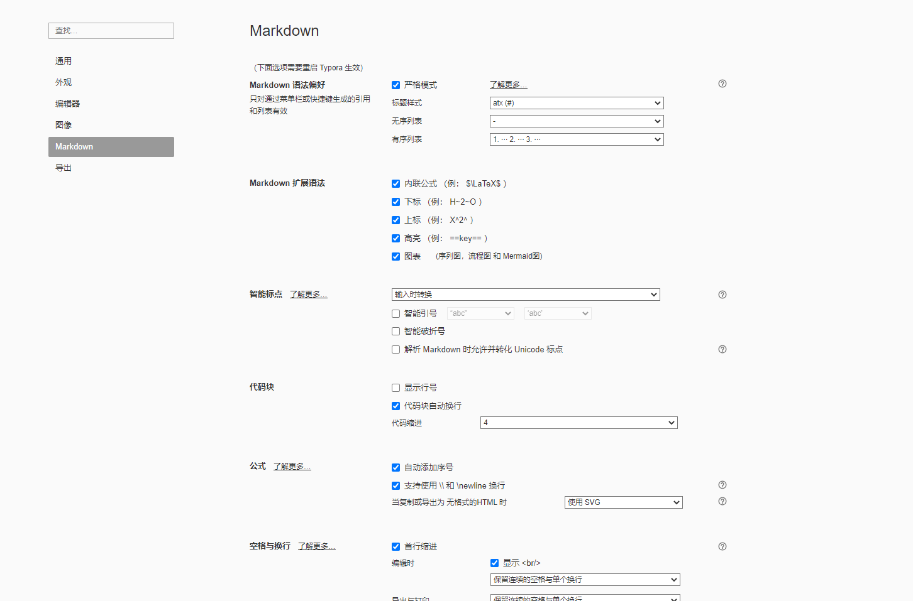

# Typora使用

Markdown可以使用通用的文本编辑器编辑，编辑之后用Markdown工具渲染即可得到PDF，WORD，HTML等格式的输出。这里推荐使用**所见即所得**的[Typora](https://typora.io/) 来编辑和渲染Markdown文档。

==**ps: 如果遇到了不好调的格式，按ctrl + / 进入纯文本格式调整**==

## UI


如上图所示，typora支持手动调节格式段落等等。一旦忘记格式，可以用任务栏来手动调节。

## 偏好设置（可选）

选择`文件——偏好设置`，设置如下：

### 默认缩进选择4



### 图像如图设置，最好保存到本地文件夹（如figs）



### 开启所有扩展语法



### 开启自动标题标号

在`C:\Users\username\AppData\Roaming\Typora\themes` 路径(在Typora的偏好设置-外观 里也可以打开这个路径)下新建一个名为`base.user.css`的空白文本文件，**注意文件后缀必须是.css**。将下列内容全部复制到`base.user.css`中，并保存。
重新启动Typora，目录和标题都会被自动添加编号。

```css

/**************************************
 * Header Counters in TOC
 **************************************/

/* No link underlines in TOC */
.md-toc-inner {
    text-decoration: none;
}

.md-toc-content {
    counter-reset: h1toc
}

.md-toc-h1 {
    margin-left: 0;
    font-size: 1.5rem;
    counter-reset: h2toc
}

.md-toc-h2 {
    font-size: 1.1rem;
    margin-left: 2rem;
    counter-reset: h3toc
}

.md-toc-h3 {
    margin-left: 3rem;
    font-size: .9rem;
    counter-reset: h4toc
}

.md-toc-h4 {
    margin-left: 4rem;
    font-size: .85rem;
    counter-reset: h5toc
}

.md-toc-h5 {
    margin-left: 5rem;
    font-size: .8rem;
    counter-reset: h6toc
}

.md-toc-h6 {
    margin-left: 6rem;
    font-size: .75rem;
}

/* .md-toc-h1:before {
    color: black;
    counter-increment: h1toc;
    content: counter(h1toc) ". "
} */

.md-toc-h1 .md-toc-inner {
    margin-left: 0;
}

.md-toc-h2:before {
    color: black;
    counter-increment: h2toc;
    content: counter(h2toc) ". "
}

.md-toc-h2 .md-toc-inner {
    margin-left: 0;
}

.md-toc-h3:before {
    color: black;
    counter-increment: h3toc;
    content: counter(h2toc) ". " counter(h3toc) ". "
}

.md-toc-h3 .md-toc-inner {
    margin-left: 0;
}

.md-toc-h4:before {
    color: black;
    counter-increment: h4toc;
    content: counter(h2toc) ". " counter(h3toc) ". " counter(h4toc) ". "
}

.md-toc-h4 .md-toc-inner {
    margin-left: 0;
}

.md-toc-h5:before {
    color: black;
    counter-increment: h5toc;
    content: counter(h2toc) ". " counter(h3toc) ". " counter(h4toc) ". " counter(h5toc) ". "
}

.md-toc-h5 .md-toc-inner {
    margin-left: 0;
}

.md-toc-h6:before {
    color: black;
    counter-increment: h6toc;
    content: counter(h2toc) ". " counter(h3toc) ". " counter(h4toc) ". " counter(h5toc) ". " counter(h6toc) ". "
}

.md-toc-h6 .md-toc-inner {
    margin-left: 0;
}

/**************************************
 * Header Counters in Content
 **************************************/

/** initialize css counter */
#write {
    counter-reset: h1
}

h1 {
    counter-reset: h2
}

h2 {
    counter-reset: h3
}

h3 {
    counter-reset: h4
}

h4 {
    counter-reset: h5
}

h5 {
    counter-reset: h6
}

/** put counter result into headings */
/* #write h1:before {
    counter-increment: h1;
    content: counter(h1) ". "
} */

#write h2:before {
    counter-increment: h2;
    content: counter(h2) ". "
}

#write h3:before, h3.md-focus.md-heading:before { /*override the default style for focused headings */
    counter-increment: h3;
    content: counter(h2) "." counter(h3) ". "
}

#write h4:before, h4.md-focus.md-heading:before {
    counter-increment: h4;
    content: counter(h2) "." counter(h3) "." counter(h4) ". "
}

#write h5:before, h5.md-focus.md-heading:before {
    counter-increment: h5;
    content: counter(h2) "." counter(h3) "." counter(h4) "." counter(h5) ". "
}

#write h6:before, h6.md-focus.md-heading:before {
    counter-increment: h6;
    content: counter(h2) "." counter(h3) "." counter(h4) "." counter(h5) "." counter(h6) ". "
}

/** override the default style for focused headings */
#write>h3.md-focus:before, #write>h4.md-focus:before, #write>h5.md-focus:before, #write>h6.md-focus:before, h3.md-focus:before, h4.md-focus:before, h5.md-focus:before, h6.md-focus:before {
    color: inherit;
    border: inherit;
    border-radius: inherit;
    position: inherit;
    left: initial;
    float: none;
    top: initial;
    font-size: inherit;
    padding-left: inherit;
    padding-right: inherit;
    vertical-align: inherit;
    font-weight: inherit;
    line-height: inherit;
}
```