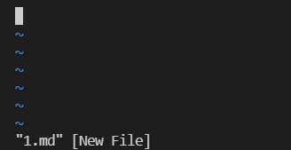
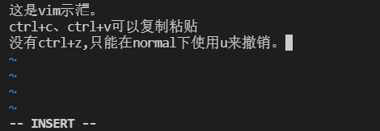
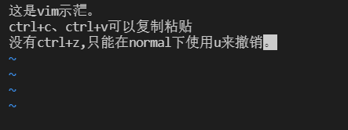
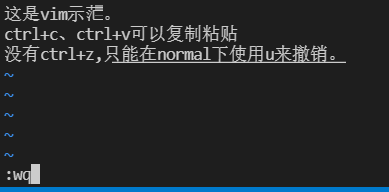
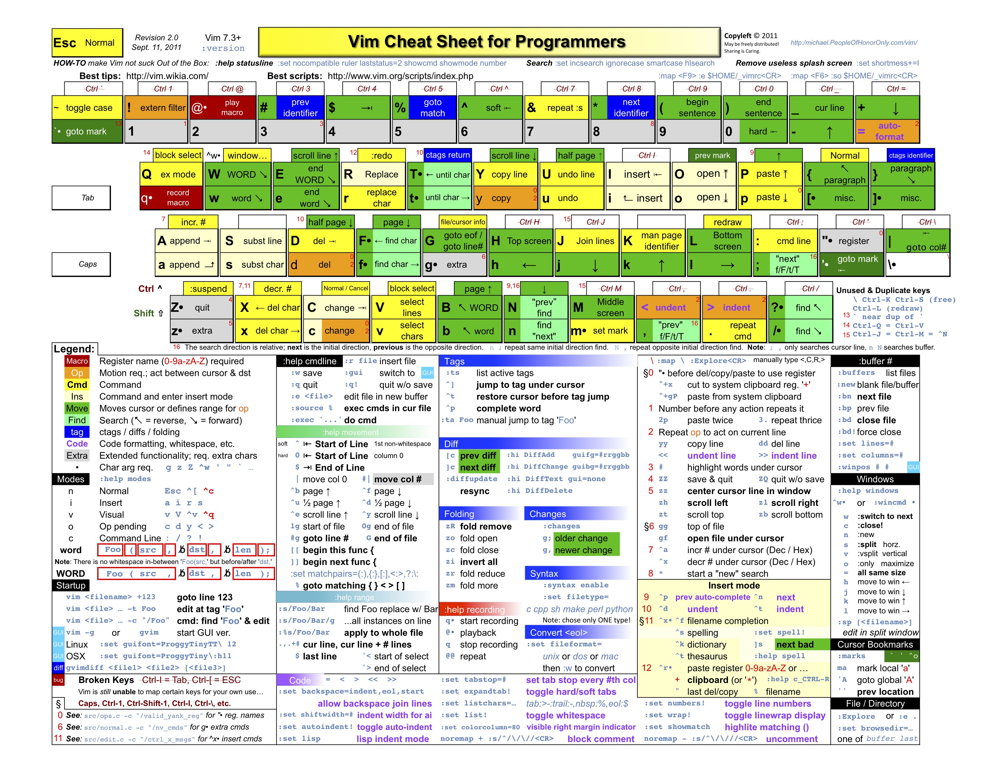

[TOC]

# VIM使用说明

## 为什么使用VIM

- **大部分人的使用场景：** linux的ssh模式下，无法打开图形化UI编辑器，因此建议采用vim操作。

- **不建议所有人使用vim：**原因如下：
  - 学习成本过高
  - 需要不断练习
  - 很痛苦，据说苦尽甘来

## 大部分人需要掌握的

### VIM模式

- Normal模式：键盘的键都有特定功能。
- Insert模式：编辑模式。

### VIM使用五部曲

1. 在命令行中用vim打开文件：```vim file```，此时进入Normal模式。



2. 按`i`(一定记住是小写)，进入insert模式。


3. 进行编辑，Insert模式支持大部分编辑命令。*（`ctrl+z`不支持，需要在normal模式下按`u`）*



4. 编辑完成后，按`esc`进入Normal模式。



5. 输入`:wq`进行保存退出。**(*`:w` *存盘,* `:q` *退出)* *



## VIM进阶

### 劝退

如果你时间多，对这个感兴趣，可以一试。

### VIM进阶攻略

[攻略地址](https://coolshell.cn/articles/5479.html)

### VIM使用“打怪升级”图解

来源：[viemu](http://www.viemu.com/a_vi_vim_graphical_cheat_sheet_tutorial.html)


### VIM命令表

来源：[coolshell](https://coolshell.cn/articles/5426.html)

